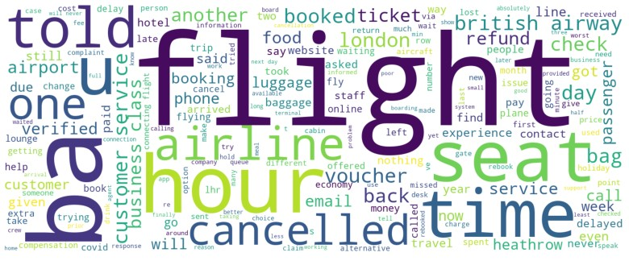
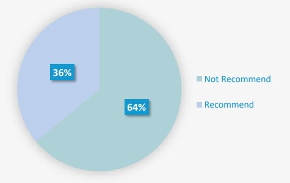
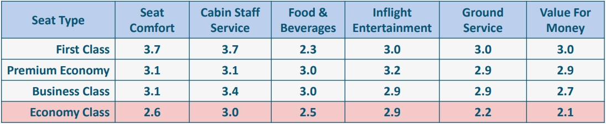
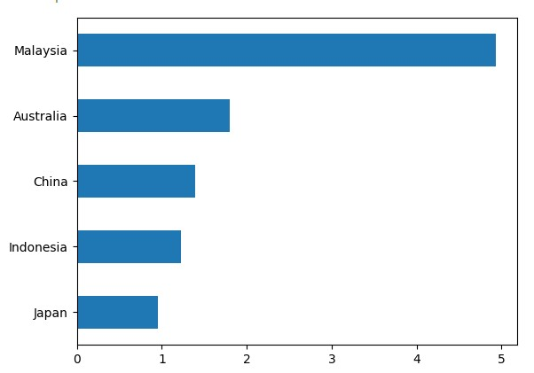
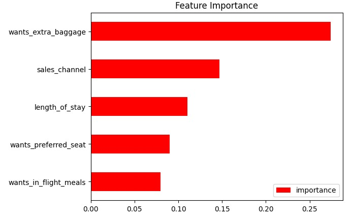

# British-Airways-Data-Science

This is my virtual internship at British Airways which i got from theforage.com.  
There are 2 tasks given.

## Task 1: Web scraping to gain company insights

Business problem : British airways (BA) want to understand how people view BA customer experience to make our operations run more efficiently and make our customer experience even better.

**Reviews Analysis**

After I looked at the data, I decided to use only the data from 2021-2022 because a lot of things have changed since the new normal and airlines are the most affected.

64% of customer reviews do not recommend our airways.

Economy Class scores significantly lower in every ranking. Here's what we can improve based on the reviews:
1. Notify for delays and cancellations
2. More friendly customer service
3. More effective luggage and refund system
4. Faster food delivery
5. And add some options for food

## Task 2: Predicting customer buying behaviour

Business Problem : British Airways want to know what factors influence customers to complete or cancel their booking processes.

Here's the graph of country with the highest bookig rate. Malaysia has 5% booking rate and japan 1%

XGBoost Classifier performs the highest accuracy of 85%. We will use this predictive model to get the feature importance.

The second graph shows the feature importance, if we go back to the description of the columns, we get:
* Wants extra baggage = if the customer wanted extra baggage in the
booking
* Sales channel = sales channel booking was made on
* Length of stay = number of days spent at destination
* Wants preferred seat = if the customer wanted a preferred seat in the
booking
* Wants in flight meals = if the customer wanted in-flight meals in the
booking
These columns are the most influential factor which leads to a purchase.
The first thing we can do to make the biggest impact maybe is to make more
space for baggage or provide discounts for extra baggage
---

# Certificate
After completing the task I got a certificate of completion from British Airways

